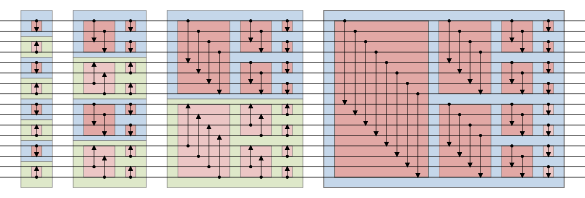
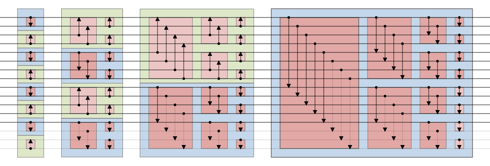
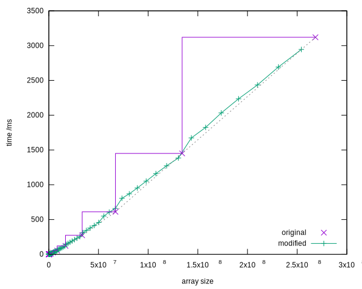
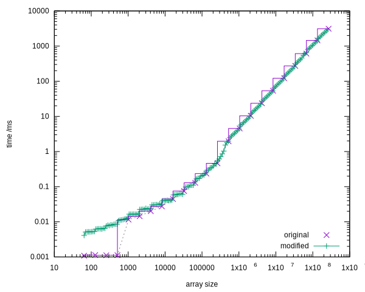
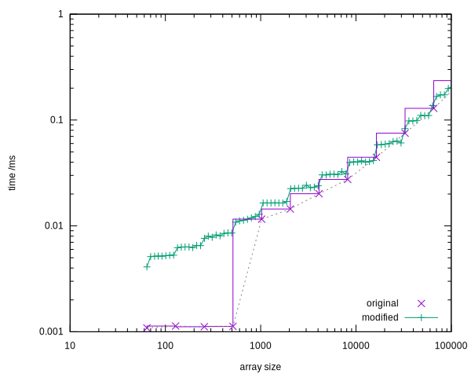

# CUDA Bitonic Sort for Arbitrary Sizes (No Padding)

A modification of NVIDIA CUDA Samples ([sortingNetworks](https://github.com/NVIDIA/cuda-samples/tree/master/Samples/2_Concepts_and_Techniques/sortingNetworks))
that implements **true arbitrary-length**
bitonic sort (including odd n) **without padding** to the next power of 2.

- In-place sorting
- Supports any array size (not limited to 2^k)
- No padding required.
    + No additional memory allocations.
    + No extra computational cost from sorting longer array.
- High performance on modern GPUs
    + Comparable to regular bitonic sort for power-of-2 sizes.
    + Often **better** than padded version on non-power-of-2 sizes.

## Key Innovation

- Only the **comparison direction** is adjusted.
- Adds only a couple of extra arithmetic/bitwise operations per stage (and tests for end-of-array).
- No changes to data indexing → excellent cache behavior and coalescing.

## How it works

The basic idea is to keep the binary structure of the bitonic network, but instead of actually padding the input array,
we can pretend the padding is there, and then choose a variant of the network that does not exchange any of the dummy
values, so that we can get away with not doing any comparisons that would involve the dummy data.

When padding is used with a normal bitonic sorting network, an input array is padded with multiple copies of an extreme value at the end, so that after sorting they will again be at the end, from where they can be removed again. However during
_intermediate_ steps real data may be exchanged into the
padding positions. This is what we need to prevent so that we can eliminate the padding without losing real data.

Exchanges between instances of the extreme value within the padding region can be neglected trivially.
The difficult part is ensuring that comparisons between real data and extreme value in the padding region also never
result in a change of state, so that they can be neglected too.

The trick is to ensure that the any comparisons that cross the end of the real data are always aligned with the overall
direction of the sort, so that the the extreme values will always be rejected as a candidate for exchange.

Fortunately the bitonic sort network has enough degrees of freedom to allow us to choose that this happens.
Any merge operation will give the same result whether the inputs are an ascending array then a descending array,
or a descending array then an ascending array. So it is perfectly fine to reverse the direction of comparisons in any
particular merge block, so long as we also reverse it for the corresponding block.
The simplest way to do this is to flip the directions of all blocks at a particular stage of
the network, so that the critical merge block that crosses the real-data/dummy-data line is aligned with the
overall direction. This can be achieved with a small modification to existing code:

>Warning: here be code and here be weeds!
>
>The direction of operations on a particular thread at a particular step is determined by the following expression:
>```c++
>thread_dir = overall_dir ^ bool(thread_index & (size / 2));
> ```
>where `size` is the size of each output block of that step in the calculation.
The direction modifier expression `^(thread_index&(size/2))` flips the direction for certain blocks. We can undo any such flip if it would affect the critical block. The index of the last item
of data is `arrayLength-1` and the corresponding thread index is `(arrayLength-1)/2`,
so we can ensure that the critical block has the desired direction by flipping *all* blocks again by what would have been the direction modifier at that block:
>```c++
>thread_dir = overall_dir ^ bool(thread_index & (size / 2))
>                   ^ bool(((arrayLength-1)/2) & (size / 2));
>```
> This can be simplified to:
>```c++
>thread_dir = overall_dir ^ bool((thread_index ^ ((arrayLength-1)/2)) & (size / 2));
>```

Once the direction is correctly set for each critical block at every step, all that remains is to not do any
comparison operations that would involve data positions beyond the end of the array.

Normal bitonic sort on padded array of 16 values including padding.


Modified bitonic sort on unpadded array of 13. Imaginary dummy values and comparisons are greyed out.


## Benchmarks

A timing comparison was performed on an NVIDIA GeForce RTX 2060 for a wide range of array lengths.
For the normal bitonic sort, only powers of 2 were actually timed; the cost of sorting a padded array.
Any time cost of padding the arrays is not included.

Bitonic Sort Performance (linear scale).


Bitonic Sort Performance (log scale).


Bitonic Sort Performance (log scale, zoomed).


Conclusion: this algorithm is comparably fast as normal bitonic sort for powers of 2,
but can perform the sort significantly faster for intermediate values.

## How to Build & Run
```bash
cmake -B build
cmake --build build
build/sortingNetworks 0     # to run unmodified network for comparison
build/sortingNetworks 1     # to run modified network allowing arbitrary sizes
``````

## Licensing
This is a derivative work of NVIDIA CUDA Samples ([sortingNetworks](https://github.com/NVIDIA/cuda-samples/tree/master/Samples/2_Concepts_and_Techniques/sortingNetworks)
) and is licensed under the same BSD 3-Clause License
(see [LICENSE](LICENSE) file).

Copyright (c) 2026, Andrew Jones — modifications to support arbitrary array sizes without padding.
The modifications are released under the same BSD 3-Clause license.

## Citation / Reference
If you use this in research, please cite:
```
Andrew Jones, "Padding-Free Bitonic Sort for Arbitrary Lengths on CUDA", 2026.
GitHub: https://github.com/apjones-proton/cuda-bitonic-sort-no-padding
```
